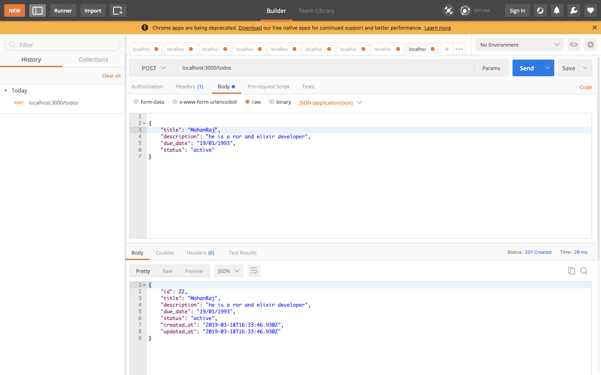

TODO API Application

   create rails api app,
```

 rails new todo --api -d postgresql

```

   create model, 
````

 rails g model name:string desc:string due_date:string status:string

````

   Then create controller,

```

 rails g controller todos index create update destroy

```

   Then create database & migrate,
```

 rails db:create db:migrate

```


   Routes like three ways to define api endpoints,

   method 1,
```

 resources :todos

```

   if use namespace in the controller like,

   class Api::V1::TodosController < ApplicationController

   method 2,
```

 namespace :api do
   namespace :v1 do
     resources :todos
   end
 end

```

   method 3,
```

 scope 'api/v1' do
  
   resources :todos, param: :_id

 end

```

Endpoints like,
```
 # index
 GET /todos

 # show
 GET /todos/:id

 # create,
 POST /todos

 # update,
 PUT /todos/:id


 # destroy,
 DELETE /todos/:id


```  

Change Table Name,

```

rails g migration change_[old_table_name]_to_[new_table_name]


rails g migration change_todos_to_products


# migration file should be
def change
  rename_table :[old_table_name], :[new_table_name]
end

```

Create Json Fromat,




Add images to README.md on GitHub
is another method,
```


```